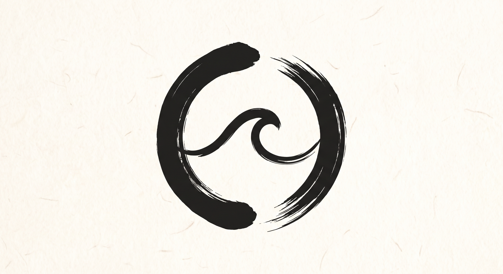
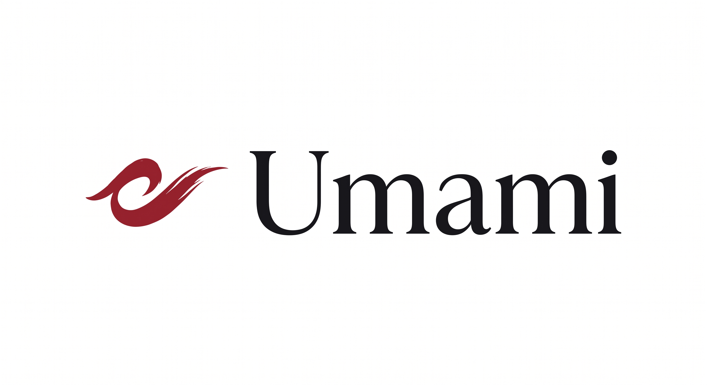
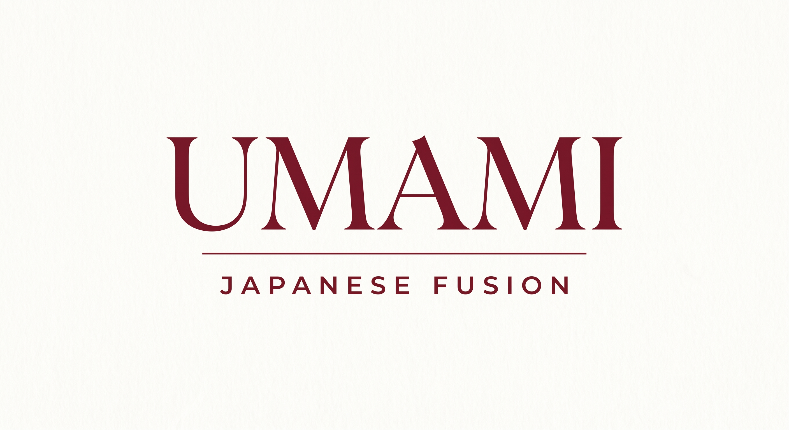

# Umami — Japanese Fusion Brand Identity

A complete AI-generated visual identity system for a Japanese fusion restaurant concept. Built entirely with AI tools: Gemini, Canva, Runway — no stock photos, no templates.

---

## Logo Concepts

**Concept 1**


**Concept 2**


**Concept 3**


---

## Brand Visuals

**Restaurant Interior**


**Food Hero Shot**


**Brand Texture**


---

## What's Inside

This repository documents the full branding process for Umami, a fictional Japanese fusion restaurant. Every visual asset was generated using AI tools. The project serves as a freelance portfolio case study demonstrating end-to-end AI-assisted brand design.

**Tools used:**
- Gemini — concept development and image generation
- Canva — logo alternatives, color palette, typography, social media templates
- Runway — motion graphics and short video content
- Claude — brand strategy, copywriting, prompt engineering

**Deliverables:**
- Brand strategy and brief
- 3 logo concept directions
- Color palette and typography system
- Social media templates (Instagram post, story, LinkedIn banner)
- Prompt library (reusable for future clients)

---

## Project Structure

```
umami-brand-identity/
├── 1-strateji/
│   └── marka-brief.md
├── 2-logo/
│   ├── Logo-1.jpeg
│   ├── Logo-2.jpeg
│   ├── Logo-3.jpeg
│   └── logo-alternatifleri.md
├── 3-sosyal-medya/
│   └── icerik-plani.md
├── assets/
│   ├── Brand Texture.jpeg
│   ├── Food Hero Shot.jpeg
│   └── Restaurant Interior.jpeg
└── README.md
```


---

# Umami — Japon Füzyon Marka Kimliği

Bir Japon füzyon restoran konsepti için tamamen yapay zeka ile üretilmiş görsel kimlik sistemi. Stok fotoğraf yok, hazır şablon yok. Yalnızca AI araçları kullanıldı.

---

## Logo Konseptleri

**Konsept 1**


**Konsept 2**


**Konsept 3**


---

## Marka Görselleri

**Restoran İç Mekan**


**Yemek Görseli**


**Marka Dokusu**


---

## İçerik

Bu repo, kurgusal bir Japon füzyon restoranı olan Umami için uçtan uca marka tasarım sürecini belgeliyor. Tüm görseller AI araçlarıyla üretildi.

**Kullanılan araçlar:**
- Gemini — konsept geliştirme ve görsel üretim
- Canva — logo alternatifleri, renk paleti, tipografi, sosyal medya şablonları
- Runway — motion grafik ve kısa video içerik
- Claude — marka stratejisi, metin yazarlığı, prompt mühendisliği

**Teslim edilenler:**
- Marka stratejisi ve brief
- 3 logo konsept yönü
- Renk paleti ve tipografi sistemi
- Sosyal medya şablonları (Instagram post, story, LinkedIn banner)
- Prompt kütüphanesi (gelecekteki müşteriler için tekrar kullanılabilir)

---

## Proje Yapısı

```
umami-brand-identity/
├── 1-strateji/
│   └── marka-brief.md
├── 2-logo/
│   ├── Logo-1.jpeg
│   ├── Logo-2.jpeg
│   ├── Logo-3.jpeg
│   └── logo-alternatifleri.md
├── 3-sosyal-medya/
│   └── icerik-plani.md
├── assets/
│   ├── Brand Texture.jpeg
│   ├── Food Hero Shot.jpeg
│   └── Restaurant Interior.jpeg
└── README.md
```

